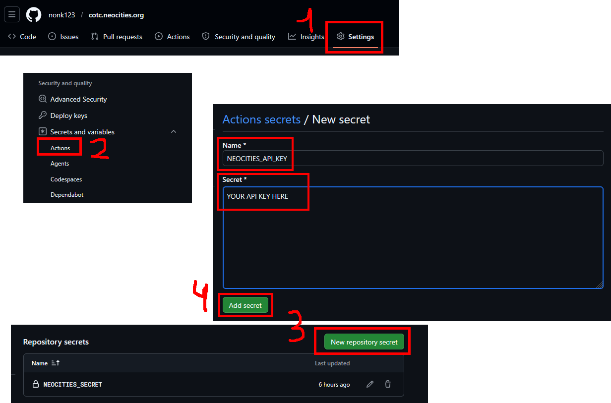

# `sanity-action`

- Builds your website using [the latest stable release](https://github.com/nonk123/sanity/releases/latest) of [sanity](https://github.com/nonk123/sanity).
- Deploys it to [GitHub Pages] or [Neocities].

## Examples

### Deploy to [Neocities]

Specify your Neocities API key by adding an actions-scoped secret to your repository and setting `inputs.neocities_secret` to its value:

```yml
jobs:
  deploy:
    runs-on: ubuntu-latest

    steps:
      - name: Checkout
        uses: actions/checkout@v7

      - name: Publish
        uses: nonk123/sanity-action@master
        with:
          neocities_secret: ${{ secrets.NEOCITIES_API_KEY }}
          # uncomment if you are a Neocities Supporter:
          #neocities_supporter: true
```

See [this article](https://github.com/bcomnes/deploy-to-neocities#usage) to find your API key, and set it in your GitHub repository as shown below:



### Deploy to [GitHub Pages]

Pushing to GitHub Pages [requires `pages: write` and `id-token: write` permissions](https://github.com/marketplace/actions/deploy-github-pages-site#usage).

Run the action with `inputs.push_to_github_pages` set to `true`:

```yml
jobs:
  deploy:
    runs-on: ubuntu-latest

    environment:
      name: github-pages
      url: ${{ steps.publish.outputs.page_url }}

    permissions:
      contents: read
      pages: write
      id-token: write

    steps:
      - name: Checkout
        uses: actions/checkout@v7

      - name: Publish
        id: publish
        uses: nonk123/sanity-action@master
        with: { push_to_github_pages: true }
```

[GitHub Pages]: https://pages.github.com
[Neocities]: https://neocities.org
